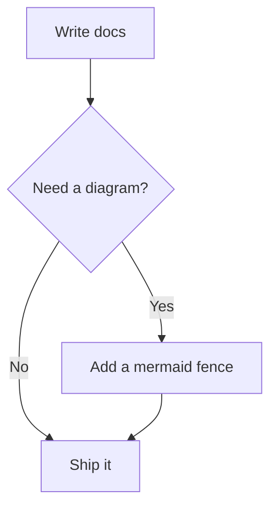

# Markdown Features

Ardo is Markdown-first, but it does not trap you in Markdown. Start with plain prose and code blocks; when a page needs a live React example, a custom component, or a design-system callout, switch to MDX without changing tools.

## Basic Syntax

### Headings

```markdown
# Heading 1

## Heading 2

### Heading 3

#### Heading 4
```

### Emphasis

```markdown
_italic_ or _italic_
**bold** or **bold**
**_bold and italic_**
~~strikethrough~~
```

### Lists

```markdown
- Unordered item 1
- Unordered item 2
  - Nested item

1. Ordered item 1
2. Ordered item 2
```

### Links and Images

```markdown
[Link text](https://example.com)

```

## GitHub Flavored Markdown

Ardo supports GitHub Flavored Markdown (GFM) out of the box.

### Tables

| Feature    | Supported |
| ---------- | --------- |
| Tables     | Yes       |
| Task Lists | Yes       |
| Autolinks  | Yes       |

### Task Lists

- [x] Write documentation
- [x] Add syntax highlighting
- [ ] Deploy to production

### Autolinks

URLs are automatically converted to links: https://reactrouter.com

## Syntax Highlighting

Code blocks are automatically highlighted using [Shiki](https://shiki.matsu.io/). The following languages are bundled and work out of the box:

| Category        | Languages                                                       |
| --------------- | --------------------------------------------------------------- |
| Web             | `javascript`, `typescript`, `jsx`, `tsx`, `html`, `css`, `scss` |
| Data & config   | `json`, `jsonc`, `yaml`, `toml`, `xml`, `graphql`               |
| Markdown        | `markdown`, `mdx`                                               |
| Shell & DevOps  | `bash`, `shell`, `dockerfile`                                   |
| General purpose | `python`, `rust`, `go`, `sql`, `diff`                           |

```typescript
interface User {
  id: string
  name: string
  email: string
}

function greetUser(user: User): string {
  return `Hello, ${user.name}!`
}
```

### Line Highlighting

Highlight specific lines using the `{lines}` syntax:

```typescript {2,4-5}
function example() {
  const highlighted = true
  const normal = false
  const alsoHighlighted = true
  const highlighted = true
  const notHighlighted = false
}
```

### Line Numbers

Enable line numbers with `showLineNumbers`:

```typescript showLineNumbers
const first = 1
const second = 2
const third = 3
```

### Title

Add a title to your code block:

```typescript title="utils/greeting.ts"
export function greet(name: string) {
  return `Hello, ${name}!`
}
```

## Mermaid Diagrams

Use `mermaid` code fences for flowcharts, sequence diagrams, state machines, and other [Mermaid](https://mermaid.js.org/) diagram types. Diagrams follow the site theme in light and dark mode, and the Mermaid library is loaded lazily — pages without diagrams never download it.

````markdown

````


Mermaid is an optional dependency — install it once in your docs project:

```bash
pnpm add mermaid
```

## Badge Component

Use badges for inline status labels, version indicators, and metadata tags. The `Badge` component is auto-registered in MDX files — no import needed.

This feature is <Badge>New</Badge>, available for <Badge variant="info">v2.0+</Badge>, and can mark <Badge variant="warning">Beta</Badge> or <Badge variant="danger">Deprecated</Badge> content.

```mdx
<Badge>New</Badge>
<Badge variant="success">Stable</Badge>
<Badge variant="warning">Beta</Badge>
<Badge variant="danger">Deprecated</Badge>
<Badge variant="info">v2.0+</Badge>
```

Badges also support an optional leading icon:

```mdx
<Badge icon="✨">New</Badge>
```

## Callout Components

Use callouts to highlight important information. Ardo accepts two equivalent syntaxes — pick whichever reads better in your file.

### GitHub-style alerts

Plain Markdown, no imports. Ardo recognises GFM alert syntax and maps each type to the matching callout.

```md
> [!NOTE]
> Useful information that users should know.

> [!TIP]
> Helpful advice for doing things better.

> [!IMPORTANT]
> Key information users need to know.

> [!WARNING]
> Urgent info that needs immediate attention.

> [!CAUTION]
> Negative potential consequences of an action.
```

Renders as:

> [!NOTE]
> Useful information that users should know.

> [!TIP]
> Helpful advice for doing things better.

> [!IMPORTANT]
> Key information users need to know.

> [!WARNING]
> Urgent info that needs immediate attention.

> [!CAUTION]
> Negative potential consequences of an action.

### JSX components

When you need a custom title or full control, the same callouts are also available as JSX. These components are auto-registered in MDX files — no import needed.

<Tip>This is a helpful tip for readers.</Tip>

<Warning>Be careful when using this feature.</Warning>

<Danger>This action cannot be undone!</Danger>

<Info>Here's some additional information.</Info>

<Note>This is a note for reference.</Note>

#### Custom titles

You can customize the callout title:

<Tip title="Pro Tip">This is a pro tip with a custom title.</Tip>

## Accordions

Use `Accordion` and `AccordionGroup` for collapsible FAQ items, optional explanations, and compact reference sections. Add `onlyOneOpen` to the group when only one item should stay open at a time.

```mdx
<AccordionGroup onlyOneOpen>
  <Accordion title="How do I install Ardo?" defaultOpen>
    Run `pnpm create ardo` to scaffold a new project.
  </Accordion>
  <Accordion title="Can I use it with existing projects?">
    Yes, Ardo can be added to an existing React Router project.
  </Accordion>
</AccordionGroup>
```

<AccordionGroup onlyOneOpen>
  <Accordion title="How do I install Ardo?" defaultOpen>
    Run `pnpm create ardo` to scaffold a new project.
  </Accordion>
  <Accordion title="Can I use it with existing projects?">
    Yes, Ardo can be added to an existing React Router project.
  </Accordion>
</AccordionGroup>

Each accordion also supports an optional `icon` and can be used standalone without a group.

## Cards

Use `Card` and `CardGroup` for compact navigation, feature summaries, and reference lists. They are
auto-registered in MDX files, so no import is needed.

<CardGroup cols={3}>
  <Card title="Configuration" href="/guide/configuration">
    Build-time options for routes, Markdown, TypeDoc, SEO outputs, and deployment helpers.
  </Card>
  <Card title="Site UI" href="/guide/site-ui">
    React-side props for the header, sidebar, footer, edit links, and context navigation.
  </Card>
  <Card title="Frontmatter" href="/guide/frontmatter">
    Page-level metadata, navigation controls, and build-output overrides.
  </Card>
</CardGroup>

```mdx
<CardGroup cols={3}>
  <Card title="Configuration" href="/guide/configuration">
    Build-time options for routes, Markdown, TypeDoc, SEO outputs, and deployment helpers.
  </Card>
  <Card title="Site UI" href="/guide/site-ui">
    React-side props for the header, sidebar, footer, edit links, and context navigation.
  </Card>
  <Card title="Frontmatter" href="/guide/frontmatter">
    Page-level metadata, navigation controls, and build-output overrides.
  </Card>
</CardGroup>
```

| Component   | Prop        | Type                  | Purpose                                                              |
| ----------- | ----------- | --------------------- | -------------------------------------------------------------------- |
| `CardGroup` | `cols`      | `1 \| 2 \| 3 \| 4`    | Preferred number of columns on wide screens. Defaults to `2`.        |
| `CardGroup` | `children`  | `ReactNode`           | Cards to render in the responsive grid.                              |
| `Card`      | `title`     | `string`              | Required card heading.                                               |
| `Card`      | `href`      | `string`              | Optional internal or external destination. Makes the card clickable. |
| `Card`      | `icon`      | `string \| ReactNode` | Registered icon name or custom React node.                           |
| `Card`      | `children`  | `ReactNode`           | Body content.                                                        |
| `Card`      | `className` | `string`              | Additional CSS class.                                                |

## Tabs

Use `Tabs` when readers need to switch between equivalent variants, such as package managers,
framework integrations, or deployment providers.

<Tabs defaultValue="pnpm">
  <TabList>
    <Tab value="pnpm">pnpm</Tab>
    <Tab value="npm">npm</Tab>
    <Tab value="yarn">Yarn</Tab>
  </TabList>
  <TabPanels>
    <TabPanel value="pnpm">

```bash
pnpm create ardo my-docs
```

    </TabPanel>
    <TabPanel value="npm">

```bash
npm create ardo@latest my-docs
```

    </TabPanel>
    <TabPanel value="yarn">

```bash
yarn create ardo my-docs
```

    </TabPanel>

  </TabPanels>
</Tabs>

````mdx
<Tabs defaultValue="pnpm">
  <TabList>
    <Tab value="pnpm">pnpm</Tab>
    <Tab value="npm">npm</Tab>
  </TabList>
  <TabPanels>
    <TabPanel value="pnpm">

```bash
pnpm create ardo my-docs
```

    </TabPanel>
    <TabPanel value="npm">

```bash
npm create ardo@latest my-docs
```

    </TabPanel>

  </TabPanels>
</Tabs>
````

| Component  | Prop           | Type        | Purpose                                                                |
| ---------- | -------------- | ----------- | ---------------------------------------------------------------------- |
| `Tabs`     | `defaultValue` | `string`    | Initial active tab value. Defaults to the first tab.                   |
| `Tabs`     | `children`     | `ReactNode` | A `TabList` and matching `TabPanels`.                                  |
| `Tab`      | `value`        | `string`    | Stable value that matches a `TabPanel`. Optional when order is stable. |
| `Tab`      | `children`     | `ReactNode` | Tab label.                                                             |
| `TabPanel` | `value`        | `string`    | Matching value for the tab content. Optional when order matches tabs.  |
| `TabPanel` | `children`     | `ReactNode` | Panel content.                                                         |

## Steps

Use `Steps` for ordered setup or migration instructions. The component expects an ordered list as
its child and styles it as a step-by-step sequence.

<Steps>
  <ol>
    <li>Create a route file in `app/routes/guide`.</li>
    <li>Add frontmatter with a `title`, `description`, and `order`.</li>
    <li>Run the docs build to validate links and generated output.</li>
  </ol>
</Steps>

```mdx
<Steps>
  <ol>
    <li>Create a route file in `app/routes/guide`.</li>
    <li>Add frontmatter with a `title`, `description`, and `order`.</li>
    <li>Run the docs build to validate links and generated output.</li>
  </ol>
</Steps>
```

| Component | Prop       | Type        | Purpose                                     |
| --------- | ---------- | ----------- | ------------------------------------------- |
| `Steps`   | `children` | `ReactNode` | Usually an `<ol>` with one `<li>` per step. |

## Icons

Use `Icon` when MDX content needs a registered SVG icon by name. Icons are opt-in: register only the
icons your site uses, usually in `root.tsx` or another file that runs before MDX pages render.

```tsx
import { registerIcons } from "ardo/ui"
import { Code2, Rocket, Zap } from "lucide-react"

registerIcons({ Code2, Rocket, Zap })
```

Once registered, the same names are available in MDX:

<CardGroup cols={3}>
  <Card title="Fast authoring" icon="Zap">
    Use Markdown until a page needs richer React components.
  </Card>
  <Card title="API-ready" icon="Code2">
    Combine written guides with generated API reference pages.
  </Card>
  <Card title="Launchable" icon="Rocket">
    Ship sitemap, robots, redirects, and LLM text artifacts from one build.
  </Card>
</CardGroup>

```mdx
<Icon name="Zap" size={20} />
<Card title="Fast authoring" icon="Zap">
  Use Markdown until a page needs richer React components.
</Card>
```

| Component | Prop      | Type                           | Purpose                                 |
| --------- | --------- | ------------------------------ | --------------------------------------- |
| `Icon`    | `name`    | `string`                       | Registered icon name.                   |
| `Icon`    | `size`    | `number`                       | Optional rendered icon size.            |
| `Icon`    | SVG props | `SVGAttributes<SVGSVGElement>` | Passed to the registered SVG component. |

## Code Groups

Display multiple code variants in tabs:

<CodeGroup labels="JavaScript,TypeScript,Python">

```js
function greet(name) {
  return `Hello, ${name}!`
}
```

```ts
function greet(name: string): string {
  return `Hello, ${name}!`
}
```

```python
def greet(name):
    return f"Hello, {name}!"
```

</CodeGroup>

## ArdoCodeBlock in `.tsx` Routes

The `ArdoCodeBlock` component can be used directly in `.tsx` route files. Just write the code as children — no template literals or special escaping needed:

```tsx
import { ArdoCodeBlock } from "ardo/ui"

export default function MyPage() {
  return (
    <ArdoCodeBlock language="tsx">
      export function Hello() {
        return <div>Hello world!</div>
      }
    </ArdoCodeBlock>
  )
}
```

The `ardo:codeblock-highlight` Vite plugin processes ArdoCodeBlock **before the JSX parser runs**, so the children can contain any syntax (`<`, `{`, `>`, etc.) without causing errors. Common indentation is stripped automatically.

The `code` prop and template literal children are also supported:

```tsx
<ArdoCodeBlock code="const x = 42" language="typescript" />
```

If the `language` prop is dynamic (from a variable), build-time highlighting is skipped and the code renders as plain text.

## Reusable MDX Snippets

Ardo uses standard MDX modules, so reusable content snippets work without a custom syntax or plugin. Put shared fragments in a `snippets/` directory and import them wherever you need the same content.

For example, define a shared prerequisite note in `app/snippets/prerequisites.mdx`. Snippet files do not need frontmatter when they are rendered inside another page:

```mdx
<Tip title="Before you start">
  This guide assumes you have {props.runtime} installed and can run packages with{" "}
  {props.packageManager}.
</Tip>
```

Then import and render it from any MDX page inside `ArdoBareContent` so the snippet does not bring its own page wrapper:

```mdx
import { ArdoBareContent } from "ardo/ui"
import Prerequisites from "../../snippets/prerequisites.mdx"

# Getting Started

<ArdoBareContent>
  <Prerequisites runtime="Node.js 22.22.1+" packageManager="pnpm" />
</ArdoBareContent>
```

Snippets can receive props in normal MDX expressions, compose Ardo components, and live alongside the rest of your application code. Because they are just MDX modules, Vite handles hot reloads and imports the same way as other route dependencies.

<Note>
  Use a relative import that matches your route depth. For example, a page in `app/routes/guide/`
  usually imports `../../snippets/prerequisites.mdx`.
</Note>

## Embedding MDX Snippets with ArdoBareContent

When you import an `.mdx` file into a `.tsx` route, it normally renders inside the full `Content` wrapper (article, header, footer, navigation). This is useful for full pages, but snippets usually need to render without that page chrome. To embed an imported MDX file as a plain content snippet in TSX, wrap it in `ArdoBareContent`:

```tsx
import { ArdoBareContent } from "ardo/ui"
import MySnippet from "./snippet.mdx"

export default function MyPage() {
  return (
    <ArdoBareContent>
      <MySnippet />
    </ArdoBareContent>
  )
}
```

## Custom Components

You can use React components directly in your markdown:

```markdown
import { MyComponent } from './components/MyComponent'

# My Page

<MyComponent prop="value" />
```

## Frontmatter

Add metadata to your pages using YAML frontmatter:

```yaml
---
title: Page Title
description: Page description for SEO
layout: doc
sidebar: true
outline: [2, 3]
---
```

See the [Frontmatter Reference](/guide/frontmatter) for all available options.
